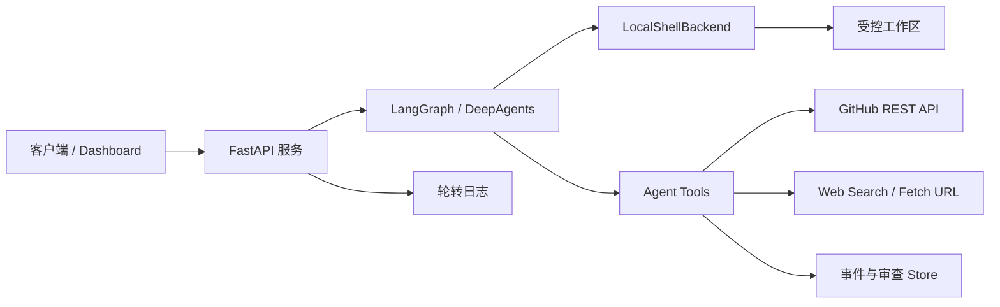

# LQ_AICoding

一个面向 AI Coding 场景的 Python 后端基础项目，目标是让 AI Agent 在受控工作区内完成代码读取、修改、验证和 GitHub 协作，同时为联网检索、代码审查记录、运行事件与日志追踪提供统一基础设施。

> **运行平台：支持 macOS 和 Windows。** 默认通过 `LOCAL_SHELL_PLATFORM=auto` 自动识别，也可在对应宿主机上显式选择 `macos` 或 `windows`。
>
> 当前项目处于持续开发阶段，仓库主要包含后端基础能力和工具层实现，尚未提供完整前端界面、稳定版业务 API 与依赖锁定文件。

## 项目目标

传统代码 Agent 如果直接获得完整 Shell 和文件系统权限，容易产生路径越界、危险命令、凭据泄露或误修改本机文件等问题。本项目围绕以下目标进行设计：

- 将 Agent 的文件操作限制在指定工作区内；
- 对可执行命令进行白名单和危险操作检查；
- 为 macOS 和 Windows 提供统一的本地路径和命令执行环境；
- 使用 GitHub 完成分支推送、Pull Request 创建与评论；
- 隔离并脱敏 GitHub Token、模型 API Key 等敏感信息；
- 记录 Agent 执行事件、代码审查发现和运行日志；
- 为后续接入 LangGraph、DeepAgents、Dashboard 和持久化 Store 提供基础结构。

## 核心能力

### 1. 受控本地 Shell

`LocalShellBackend` 基于 DeepAgents 的 Sandbox 协议实现，提供：

- 文件读取、写入、编辑、搜索、上传和下载；
- `/projects`、`/skills`、`/policies` 等虚拟路径映射；
- 工作区边界校验，阻止路径穿越和越界访问；
- 命令白名单、危险命令拦截和 Shell 操作符限制；
- macOS / Windows 命令、路径和 Python 虚拟环境支持；
- 命令超时、输出截断和敏感 Token 脱敏。

### 2. GitHub 协作

项目已统一使用 GitHub，内置能力包括：

- 通过 GitHub REST API 创建 Pull Request；
- 相同源分支和目标分支已存在 PR 时自动复用；
- 向 Pull Request 发布普通评论；
- 通过 `GIT_ASKPASS` 为 HTTPS Git 操作提供非交互式认证；
- 默认目标分支为 `main`；
- GitHub Token 不进入命令参数和日志。

当前仓库自身的远程地址使用 SSH：

```text
git@github.com:liqiangZzz/LQ_AICoding.git
```

因此，本仓库的日常 `git pull` / `git push` 使用本机 SSH Key；`GITHUB_TOKEN` 主要供项目内 GitHub REST API 和采用 HTTPS remote 的受控工作区仓库使用。

### 3. 安全 HTTP 访问

网络工具提供基础 SSRF 防护：

- 仅允许 HTTP 和 HTTPS；
- 拒绝本机、私有网络、链路本地和保留地址；
- 每次重定向前重新校验目标地址；
- 通过 DNS Pin 降低 DNS Rebinding 风险；
- 限制最大重定向次数。

### 4. 联网搜索与页面读取

- `web_search`：通过智谱 Web Search API 获取公开资料；
- `fetch_url`：读取指定网页并进行内容整理；
- 外部依赖采用延迟初始化，非必要功能缺失时不会阻止基础服务启动；
- 搜索和抓取错误会脱敏后返回，避免凭据进入日志或模型上下文。

### 5. 审查记录与运行事件

- 结构化保存代码审查发现；
- 支持只读 Reviewer 子 Agent、GitHub PR 上下文、确定性 diff 行号校验；
- 将发现项与 LangGraph `thread_id` 关联；
- 记录工具调用的开始、完成和失败状态；
- 区分 coding、analysis、planning、qa、sync、inspect 等任务类型；
- 只读任务禁止创建 Pull Request 等外部写操作。

### 6. 日志与配置

- 使用 `.env` 管理本地配置；
- 使用可自动切换的 macOS / Windows 路径配置；
- 后端日志与 Agent 运行日志分离；
- 使用 `TimedRotatingFileHandler` 按时间轮转日志；
- 支持日志级别、轮转周期和保留天数配置。

## 架构概览



## 项目结构

```text
LQ_AICoding/
├── agent/
│   ├── app.py                         # FastAPI 服务入口
│   ├── env_utils.py                   # .env 加载与平台配置映射
│   ├── api/                           # API 模块预留目录
│   ├── store/                         # 持久化 Store 模块预留目录
│   ├── backends/
│   │   ├── local_shell.py             # 受控本地 Shell 后端
│   │   ├── permissions.py             # 路径与命令安全校验
│   │   ├── workspace.py               # 工作区路径解析
│   │   └── LocalShellBackend_Analysis.md
│   ├── core/
│   │   ├── settings.py                # 数据、日志与工作区配置
│   │   ├── logging_config.py          # 日志初始化与轮转
│   │   ├── task_intent.py             # 任务类型与只读权限判断
│   │   └── events.py                  # Agent 运行事件记录
│   ├── reviewer_rules/                # 内置代码审查兜底规则
│   └── tools/
│       ├── github_api.py              # GitHub REST API 底层封装
│       ├── github_tools.py            # GitHub Agent 工具
│       ├── fetch_url_tools.py         # 网页读取工具
│       ├── web_search.py              # 联网搜索工具
│       ├── safe_http.py               # SSRF 防护与安全重定向
│       ├── reviewer_tools.py          # 代码审查规则、diff 与 finding 工具
│       ├── reviewer_diff.py           # diff 解析与 finding 位置校验
│       └── runtime_context.py         # LangGraph 运行上下文
├── .env.example                       # 环境变量示例
├── .gitignore                         # 本机文件与敏感配置忽略规则
└── README.md
```

## 环境要求

- **操作系统：macOS 或 Windows**；
- Python 3.11 或更高版本；
- Git；
- 推荐配置 GitHub SSH Key；
- 如需调用 GitHub PR API，需要 GitHub Personal Access Token；
- 如需联网搜索，需要智谱搜索 API Key；

## 快速开始

### 1. 克隆仓库

```bash
git clone git@github.com:liqiangZzz/LQ_AICoding.git
cd LQ_AICoding
```

如果尚未配置 SSH，也可以使用 HTTPS：

```bash
git clone https://github.com/liqiangZzz/LQ_AICoding.git
cd LQ_AICoding
```

### 2. 激活 Conda 环境

```bash
conda activate deepagents-env-ai-coding
python -c "import sys; print(sys.executable)"
```

输出应指向 Conda 环境下的 Python，不应指向项目内的 `.venv`。如果终端前缀同时出现 `(.venv)`，先执行 `deactivate`，再重新激活 Conda 环境。

如果尚未创建该环境，macOS 和 Windows 都可执行：

```bash
conda create -n deepagents-env-ai-coding python=3.13 -y
conda activate deepagents-env-ai-coding
```

### 3. 安装依赖

`pyproject.toml` 已声明运行依赖和开发检查依赖。在上述 Conda 环境中执行：

```bash
python -m pip install --upgrade pip
python -m pip install -e ".[dev]"
```

如果只运行服务、不需要 pytest 和 Ruff，可以执行：

```bash
python -m pip install -e .
```

### 4. 创建本地配置

macOS：`cp .env.example .env`；Windows PowerShell：`Copy-Item .env.example .env`。

根据本机目录和实际使用的服务编辑 `.env`。通常保留 `LOCAL_SHELL_PLATFORM=auto` 即可；需要显式选择时填写与当前宿主机一致的 `macos` 或 `windows`。该配置用于同一套代码在两类系统间切换，不模拟另一种操作系统。不要将 `.env` 提交到 GitHub。

### 5. 启动服务

```bash
uvicorn agent.app:app --host 127.0.0.1 --port 8000 --reload
```

启动后可访问：

- OpenAPI 页面：`http://127.0.0.1:8000/docs`
- ReDoc 页面：`http://127.0.0.1:8000/redoc`

当前 FastAPI 已提供健康检查、任务创建/查询和日志查询路由，并接入 DeepAgent 运行时。

## 关键环境变量

### GitHub

| 变量 | 必填 | 默认值 | 说明 |
|---|---:|---|---|
| `GITHUB_TOKEN` | 按需 | 空 | GitHub REST API 与 HTTPS Git 认证令牌 |
| `GITHUB_API_BASE_URL` | 否 | `https://api.github.com` | GitHub REST API 地址 |

代码还兼容由 CI 或外部运行环境注入的 `GH_TOKEN`、`SCM_GITHUB_TOKEN`。读取优先级为：

```text
GITHUB_TOKEN > GH_TOKEN > SCM_GITHUB_TOKEN
```

### 模型与搜索

| 变量 | 说明 |
|---|---|
| `DEEPSEEK_API_KEY` / `DEEPSEEK_BASE_URL` | DeepSeek 模型配置 |
| `MAIN_MODEL` | Agent 主模型，默认 `deepseek-v4-pro` |
| `INTENT_MODEL` | 意图分类模型，留空时跟随 `MAIN_MODEL` |
| `INTENT_MODEL_TEMPERATURE` / `INTENT_MODEL_MAX_TOKENS` | 意图分类输出参数 |
| `ZHIPU_API_KEY` | 智谱 Web Search 配置 |

### 工作区

| 变量 | 说明 |
|---|---|
| `LOCAL_SHELL_PLATFORM` | `auto`、`macos` 或 `windows`，默认自动识别宿主机 |
| `AI_WORKSPACE_ROOT` | Agent 工作区根目录；默认 `~/ai_workspace` |
| `LOCAL_SHELL_WORKSPACE` | 本地 Shell 工作区；默认继承 `AI_WORKSPACE_ROOT` |
| `*_MACOS` / `*_WINDOWS` | 对应路径变量的平台专用值；当前平台的值会覆盖通用值，留空则沿用通用值，两者都为空时使用代码默认值 |
| `LOCAL_SHELL_SHARED_PYTHON_VENV` | 工作区内共享 venv 相对路径 |
| `LOCAL_SHELL_CREATE_PYTHON_VENV` | 是否在首次启动时创建共享 Python venv，默认关闭 |
| `LOCAL_SHELL_ENABLE_COMMAND_GUARD` | 是否启用命令安全守卫 |

### 沙箱

当前版本只支持 `LocalShellBackend`。它直接在本机受控工作区中执行命令，macOS 使用 `/bin/sh`，Windows 使用 `cmd.exe`，不需要启动 localhost OpenSandbox 服务。

| 变量 | 说明 |
|---|---|
| `SANDBOX_TYPE` | 当前固定为 `local_shell`；其他值会在后端初始化时被拒绝 |
| `LOCAL_SHELL_OUTPUT_ENCODING` | 子进程输出编码；留空时根据当前系统自动选择 |

远程 Sandbox 相关变量尚未接入，因此 `.env` 和 `.env.example` 中不需要配置 `SANDBOX_DOMAIN`、`OPENSANDBOX_API_KEY` 等参数。

### 数据与日志

| 变量 | 说明 |
|---|---|
| `LQ_AICODING_DATA_DIR` | 数据目录 |
| `CHECKPOINT_DB_PATH` | LangGraph checkpoint SQLite 路径 |
| `STORE_DB_PATH` | 业务 Store SQLite 路径 |
| `LANGGRAPH_STORE_DB_PATH` | LangGraph Store SQLite 路径 |
| `LQ_AICODING_LOG_DIR` | 日志目录 |
| `LQ_AICODING_LOG_LEVEL` | 日志级别 |
| `LQ_AICODING_LOG_WHEN` / `LQ_AICODING_LOG_INTERVAL` | 日志轮转时机与间隔 |
| `LQ_AICODING_LOG_RETENTION_DAYS` | 日志保留天数 |
| `LQ_AICODING_DEBUG_STREAM_EVENTS` | 设为 `1` 时记录原始流式事件，仅用于排障 |

### Agent 运行限制

`AGENT_MAX_TOOL_CALLS` 和 `AGENT_MAX_SECONDS` 是全局上限。如果需要按任务调整，可使用
`AGENT_<TASK_KIND>_MAX_TOOL_CALLS` 和 `AGENT_<TASK_KIND>_MAX_SECONDS`，其中 `TASK_KIND`
支持 `CODING`、`ANALYSIS`、`PLANNING`、`REVIEW`、`QA`、`INSPECT`、`SYNC`。

## GitHub Token 权限建议

优先使用 Fine-grained personal access token，并仅授权需要操作的仓库。根据启用的功能授予最小权限：

- 创建 Pull Request：`Pull requests: Read and write`；
- 发布 PR 普通评论：`Issues: Read and write`；
- 使用 HTTPS 推送代码：`Contents: Read and write`。

如果仓库 remote 使用 SSH，则 Git 推送不依赖 `GITHUB_TOKEN`。

## 安全注意事项

- `.env`、Token、密码和模型 API Key 不得提交到版本库；
- Token 一旦出现在截图、日志、聊天或提交历史中，应立即撤销并重新生成；
- 不要把 Token 写进 Git remote URL；
- 不要在命令参数、异常文本或日志中输出敏感值；
- 本地 Shell 后端属于本地开发级安全边界，不等同于生产级容器隔离；
- 生产环境还应增加独立系统用户、容器、网络策略、审计和密钥管理服务。

## 开发检查

提交前至少执行 Python 语法检查：

```bash
python -m compileall -q agent
```

然后执行单元测试和静态检查：

```bash
pytest
ruff check .
```

## 当前开发状态

已具备：

- FastAPI 服务入口；
- 环境变量和跨平台路径映射；
- 日志轮转；
- 本地受控 Shell 与虚拟工作区；
- GitHub PR 和评论工具；
- 安全网页读取与联网搜索；
- 代码审查发现与运行事件基础能力；
- Agent 工厂、SQLite checkpoint、仓库映射和长期记忆。

待完善：

- Dashboard 认证、SSE 实时文本流和更完整的任务管理 API；
- 生产级数据库与 checkpoint 生命周期集成；
- 依赖版本锁定和 CI 检查流程；
- 前端 Dashboard 与部署文档。

## 核心代码文档

建议先阅读 [`agent/README_代码导读.md`](agent/README_代码导读.md)，其中提供源码与说明文档的一对一对照表。

- [`server.py 说明`](agent/server_说明.md)
- [`runtime.py 说明`](agent/core/runtime_说明.md)
- [`streaming_runtime.py 说明`](agent/core/streaming_runtime_说明.md)
- [`checkpoint_history.py 说明`](agent/core/checkpoint_history_说明.md)
- [`repo_mapping.py 说明`](agent/core/repo_mapping_说明.md)
- [`repo_memory.py / repo_memory_update.py 说明`](agent/core/repo_memory_说明.md)
- [`local_shell.py 说明`](agent/backends/local_shell_说明.md)
- [`sqlite_store.py 说明`](agent/store/sqlite_store_说明.md)
- [`中间件总览`](agent/core/middleware/中间件总览.md)
- [`工具包总览`](agent/tools/工具包总览.md)

## License

当前仓库尚未添加开源许可证。在许可证明确之前，默认保留所有权利。
