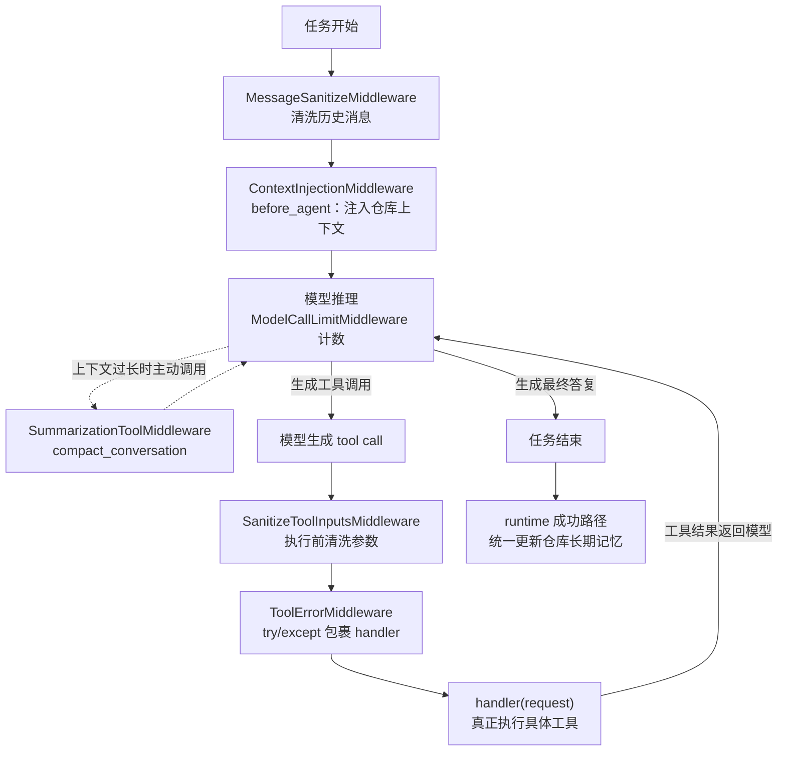
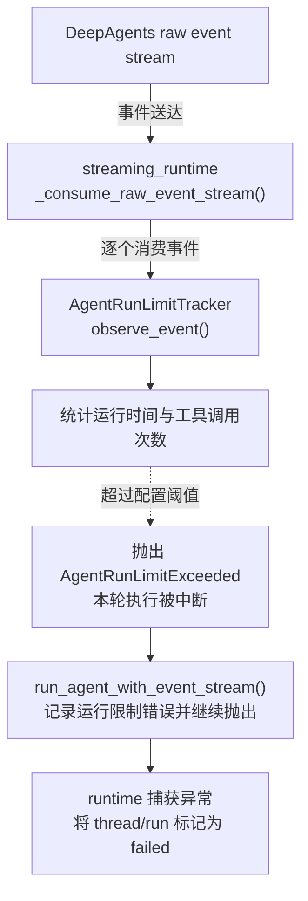
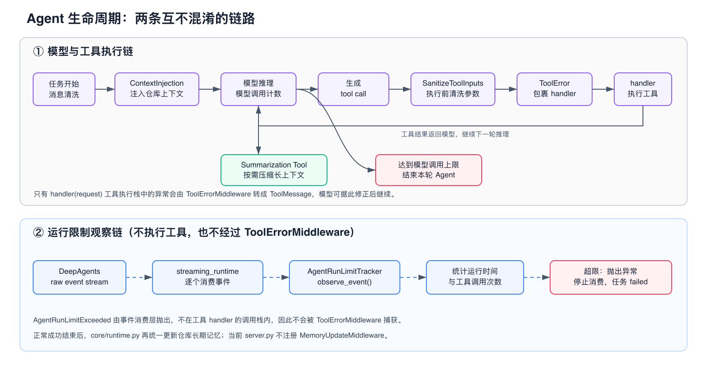

# 中间件总览：触发机制与设计分析

> 本文对应 `agent/core/middleware/` 下多个中间件文件，不是一对一源码说明。

## 1. 总体结论

`agent/core/middleware` 中的组件并不使用同一个触发点，因为它们处理的数据在 Agent 生命周期中的成熟时间不同。

核心设计原则是：

> 数据什么时候完整，就在什么时候处理。

- 仓库上下文在任务开始时已经确定，因此使用 `before_agent`。
- 工具参数只有模型发起工具调用时才出现，因此使用 `wrap_tool_call` 前置处理。
- 工具异常只有执行工具后才可能发生，因此通过 `wrap_tool_call` 包裹下游执行。
- 工具调用次数和运行时间需要跨越整轮任务累计，因此通过事件流持续观察。
- 模型调用数由 `ModelCallLimitMiddleware` 在 Agent 图内部限制；运行时长和工具次数由事件流观察器限制。
- 仓库长期记忆由 `core/runtime.py` 在任务成功后统一写回，当前不再注册 `MemoryUpdateMiddleware`。

## 2. 生命周期概览

### 2.1 工具执行链



### 2.2 运行限制异常链（不执行工具）



静态图片版（适用于不支持 Mermaid 的 Markdown 预览器）：



可缩放矢量源图为 `中间件执行链.svg`；PNG 与 SVG 表达的是同一条当前调用链。

这里要特别区分：

- 图中的两条链故意不使用箭头相连：工具执行链负责实际调用工具；运行限制观察链只读取执行期间产生的事件。
- `AgentRunLimitExceeded` 不经过 `ToolErrorMiddleware`，因为它由事件消费层抛出，不是在 `handler(request)` 的工具调用栈中产生。
- **真正执行工具**：发生在 DeepAgents 工具节点调用中间件传入的 `handler(request)` 时；当前同步路径可在 `tool_error.py:wrap_tool_call()` 中看到这次调用。
- **运行限制计数**：发生在 `streaming_runtime.py:_consume_raw_event_stream()` 消费事件时，它调用 `AgentRunLimitTracker.observe_event(event)`，只观察时间和工具生命周期事件。
- `run_limits.py` 不直接调用任何 GitHub、文件、Shell 或搜索工具，也不是工具执行器。

```text
工具执行链：
模型 tool call
  -> SanitizeToolInputsMiddleware
  -> ToolErrorMiddleware
  -> handler(request)
  -> 具体工具函数 / LocalShellBackend

限制观察链：
DeepAgents 执行过程
  -> raw event stream
  -> _consume_raw_event_stream()
  -> AgentRunLimitTracker.observe_event()
  -> 抛出 AgentRunLimitExceeded
  -> run_agent_with_event_stream() 记录错误并继续抛出
  -> runtime 将 thread/run 标记为 failed
```

## 3. 组件与触发点对照

先区分两个时间点：`server.get_agent()` 只是注册中间件；真正调用具体方法发生在 Agent 运行生命周期中。

| 文件 | 谁注册/调用 | 什么时候真正调用 | 触发频率 | 主要职责 |
|---|---|---|---:|---|
| `message_sanitize.py` | server 注册，Agent 调用 | 模型读取历史消息之前 | 每轮 Agent | 清理无效或不兼容消息块 |
| `context_injection.py` | server 注册，DeepAgents 调用 | 第一轮模型推理之前的 `before_agent` | 每轮 Agent 一次 | 注入仓库标识和长期记忆 |
| `tool_sanitize.py` | server 注册，工具节点调用 | 每个工具真正执行前的 `wrap_tool_call` | 每次工具调用 | 清洗参数并拒绝越界输入 |
| `tool_error.py` | server 注册，工具节点调用 | 参数清洗通过后，包裹实际工具执行 | 每次工具调用 | 捕获执行异常并返回错误消息 |
| DeepAgents `SummarizationToolMiddleware` | server 注册，模型按需调用 | 模型决定压缩长上下文时 | 按需 | 提供显式会话压缩工具 |
| LangChain `ModelCallLimitMiddleware` | server 注册，Agent 调用 | 每次模型调用时 | 每次模型调用 | 限制单轮模型调用次数 |
| `run_limits.py` | streaming runtime 直接创建 | 事件消费者收到每个事件时；不执行工具 | 每个运行事件 | 观察并累计工具次数和运行时间 |
| `memory_update.py` | 当前未注册 | 无 | 无 | 保留的旧兜底实现；实际由 runtime 单点写回 |
| `__init__.py` | Python 导入系统 | 导入 middleware 包时 | 每进程按导入缓存 | 声明 Python 包 |

## 4. ContextInjectionMiddleware注入仓库标识和长期记忆

### 4.1 触发点

`ContextInjectionMiddleware` 使用 `before_agent/abefore_agent`，在整轮 Agent 开始前执行一次。

### 4.2 为什么在任务开始时触发

仓库地址、仓库标识和长期记忆属于整轮任务共享的背景信息，在一次任务中通常不会变化。如果每次模型调用前都执行，会重复访问 Store、重复插入 SystemMessage，并增加 Token 消耗。

### 4.3 设计收益

- 模型第一次推理时就能获得仓库背景。
- 每轮只注入一次，降低 Store 和 Token 开销。
- 不修改用户消息，只追加仓库上下文。
- 没有 `repo_url` 时可以跳过，不影响普通问答任务。
- 即使仓库记忆尚未创建，也会注入基础仓库标识和记忆文件路径，让 Agent 始终知道自己对应的仓库。
- 长期记忆只作为参考，真实文件和 Git 状态仍是事实来源。

## 5. SanitizeToolInputsMiddleware清洗参数并拒绝越界输入

### 5.1 触发点

`SanitizeToolInputsMiddleware` 使用 `wrap_tool_call/awrap_tool_call`，**在每次工具执行前清洗参数**。

### 5.2 为什么在工具边界触发

路径、URL、`offset`、`limit` 等参数是模型在每次工具调用时动态生成的。任务开始时还没有这些参数，因此无法提前统一校验。

```text
模型生成工具参数
    → 中间件读取 ToolCallRequest
    → 规范化或拒绝参数
    → 参数合法时调用下游 handler
```

### 5.3 设计收益

- 在文件系统或网络请求发生前拦截危险参数。
- 多个工具共享统一的路径和 URL 规则。
- 业务工具不需要重复编写通用参数校验。
- 参数错误被转换成结构化 `ToolMessage`，模型可以修正后继续。
- 通过 `request.override()` 创建新请求，避免修改原始调用对象。
- `LocalShellBackend` 保留最终安全校验，形成双层安全边界。

## 6. ToolErrorMiddleware捕获执行异常并返回错误消息

### 6.1 触发点

`ToolErrorMiddleware` 同样使用 `wrap_tool_call/awrap_tool_call`，但它通过 `try/except` 包裹下游工具执行。

### 6.2 与参数清洗的区别

```text
SanitizeToolInputsMiddleware：在执行前防止明显错误发生
ToolErrorMiddleware：错误已经发生后负责兜底恢复
```

参数清洗处理路径穿越、敏感目录和参数类型等可提前识别的问题。错误中间件处理文件不存在、权限不足、网络失败和工具超时等运行时问题。

### 6.3 设计收益

- 业务工具不必分别维护大量 `try/except`。
- 将不同异常转换成统一、结构化的中文错误结果。
- 一次工具失败不会立即终止整轮 Agent。
- 模型可以根据 `error` 和 `hint` 调整参数或切换方案。
- 能把前端原来的 `in_progress` 事件更新为 `error`，避免界面长期显示运行中。
- 同时记录通用工具错误事件，便于排查。

## 7. AgentRunLimitTracker观察并累计工具次数和运行时间

### 7.1 触发点

`run_limits.py` 中的 `AgentRunLimitTracker` 没有继承 `AgentMiddleware`，它被设计为在 LangGraph 流式事件消费阶段持续调用 `observe_event()`。

### 7.2 为什么不使用固定生命周期钩子

⭐️**运行限制关注的是跨步骤累计状态，包括工具调用次数、运行时间和重复循环风险**。`before_agent` 看不到执行过程，`after_agent` 又已经太晚，所以**需要伴随事件流持续检查。**

### 7.3 设计收益

- 跨多个模型循环累计工具调用。
- 每个事件到达时都能检查运行时间。
- 不依赖具体模型供应商。
- 不使用模型消息分块推算模型调用次数，减少误判。
- 可针对 `coding`、`qa`、`planning` 等任务设置不同阈值。
- 超限后可以主动终止事件流，控制费用和执行时间。

## 8. 仓库长期记忆为何不再由中间件写回

### 8.1 触发点

`MemoryUpdateMiddleware` 的实现仍在目录中，但当前没有加入 `server.py` 的 middleware 列表，
因此 `after_agent/aafter_agent` 不会被调用。

### 8.2 为什么在任务结束后触发

`core/runtime.py` 已掌握最终成功/失败状态和任务结果，只有成功路径才更新仓库长期记忆。
把写回集中到 runtime 可以避免中间件与运行时重复写入，也避免失败任务沉淀不稳定结论。

### 8.3 设计收益

- 成功任务只写一次 Store。
- 避免把完整对话和工具日志写入长期记忆。
- 只提取最后一条 assistant 消息，降低过程噪声。
- 写入前统一做敏感信息检查和 Token 脱敏。
- 新增绕过 runtime 的执行入口时，必须显式决定是否接入记忆写回。

## 9. 为什么这种分层优于统一触发

如果把所有逻辑都放在同一个钩子中：

- `before_agent` 无法获得工具参数和执行异常。
- 每次 `wrap_tool_call` 重复注入仓库记忆会浪费 Token。
- `after_agent` 再检查工具参数已经太晚。
- 仅在任务结束后检查运行时间，无法阻止失控循环。
- 长期记忆、参数安全和异常处理混在一起会增加耦合。

分层后形成清晰结构：

```text
开始阶段：准备上下文
执行阶段：校验输入
异常阶段：统一恢复
全过程：限制资源
结束阶段：沉淀结果
```

## 10. 总体设计收益

- **职责单一**：每个文件只处理一种横切能力。
- **降低开销**：不变内容不会在每次调用时重复处理。
- **支持自我恢复**：参数和运行异常会返回结构化 `ToolMessage`。
- **统一安全策略**：路径、敏感目录、脱敏和阈值集中维护。
- **同步异步一致**：同步和异步路径都有对应钩子。
- **便于测试**：上下文、参数、错误、限制和记忆可以分别测试。

## 11. 当前代码的实际接入状态

当前组件已经接入真实运行链路：

- `agent/server.py:get_agent()` 把消息清洗、上下文注入、工具参数清洗、显式会话压缩、模型调用限制和工具异常处理传给 `create_deep_agent()`。
- `agent/core/streaming_runtime.py:_consume_raw_event_stream()` 创建 `AgentRunLimitTracker`，并在消费每个事件前调用 `observe_event()`。
- `agent/core/runtime.py` 在任务成功后统一更新仓库长期记忆，`MemoryUpdateMiddleware` 当前不注册。
- `server.py` 还会根据任务类型设置 `LocalShellBackend.read_only`，权限限制不再只依赖提示词。

## 12. 当前实现中需要关注的问题

以下是当前实现继续维护时需要关注的边界。

### 12.1 `context_injection.py`

- 正常路径优先使用 `server.py` 预读并放入 configurable 的记忆内容；直接查询 Store 只是兜底。
- 注入的记忆可能过期，因此提示词必须始终强调以实时文件、Git 和测试结果为准。

### 12.2 `memory_update.py`

- 当前只由 runtime 成功路径更新记忆；如果未来重新注册 middleware，必须先解决双写、幂等和失败任务污染问题。
- 敏感信息判断宁可保守；扩展抽取规则时应同时补测试。

### 12.3 `tool_sanitize.py`

- 当前同时使用 `PurePosixPath` 和 `PureWindowsPath` 识别两类绝对路径。
- 新增工具参数名时，要同步判断它是否属于路径、GitHub URL 或整数参数，避免绕过统一清洗。

### 12.4 `tool_error.py`

- 工具边界会捕获所有异常并返回结构化错误，这是为了让模型有机会修正输入。
- 不可恢复配置错误仍可能被模型重试，最终依赖运行限制终止；新增错误类型时应提供明确 hint。

### 12.5 `run_limits.py`

- DeepAgents 不同版本的事件结构可能变化，工具计数解析需要通过事件流测试持续验证。
- 阈值来自环境变量，过小会让正常 coding 任务提前结束，过大则失去保护作用。

## 13. 最终评价

从架构意图看，这套中间件设计是合理的：

- 触发点与数据生命周期匹配；
- 参数清洗和异常处理形成前后两道防线；
- 上下文注入和记忆写回形成任务首尾闭环；
- 运行限制覆盖整个执行过程；
- 每个模块职责清楚，便于扩展和测试。

当前中间件已完成装配。后续重点是随着 DeepAgents 版本升级验证消息、工具调用和事件结构是否仍兼容。
