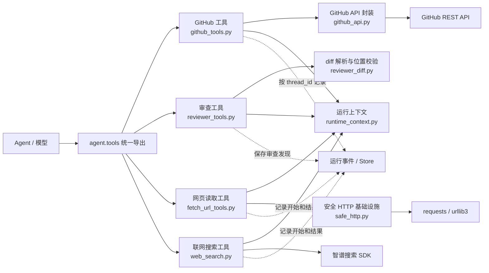

# 工具包总览：Agent Tools 触发机制与设计分析

> 本文对应 `agent/tools/` 下多个工具文件，不是一对一源码说明。

## 1. 总体结论

`agent/tools` 不是一组触发方式完全相同的函数，而是分成了三个层次：

1. **模型可调用工具层**：使用 `@tool` 声明，由 Agent 模型根据任务需要选择调用。
2. **内部业务服务层**：不直接暴露给模型，只在上层工具执行时被普通 Python 函数调用。
3. **运行期基础设施层**：负责读取 LangGraph 上下文、安全访问网络、记录事件和隐藏内部参数。

这些文件触发点不同的根本原因是：

> 每个模块处理的信息出现时间不同，因此应该在最接近信息产生的位置执行。

- 模型生成工具调用后，才会触发 `@tool` 函数。
- GitHub API 参数准备完成后，才调用底层 API 封装。
- 发起每一跳 HTTP 请求前，都需要执行 SSRF 和 DNS 校验。
- 工具真正运行在 LangGraph 节点中时，才能读取 `thread_id` 和 `task_kind`。
- Agent 工厂导入工具包时，`__init__.py` 才负责集中导出工具。

## 2. 工具包分层结构



## 3. 当前工具目录结构

### 3.1 文件职责

| 文件 | 类型 | 作用 |
|---|---|---|
| `__init__.py` | 工具导出入口 | 统一导出可供 Agent 注册的工具 |
| `github_tools.py` | Agent Tool | 创建或复用 GitHub PR、发布 PR 评论 |
| `github_api.py` | 支撑模块 | GitHub URL 解析、Token 读取、API 请求和脱敏 |
| `web_search.py` | Agent Tool | 智谱联网搜索 |
| `fetch_url_tools.py` | Agent Tool | 读取网页并转换为 Markdown/文本 |
| `safe_http.py` | 支撑模块 | SSRF 防护、DNS Pin 和安全重定向 |
| `reviewer_tools.py` | Agent Tool | 写入和读取代码审查发现 |
| `reviewer_diff.py` | 支撑模块 | 解析本地 Git diff，并校验 finding 是否位于真实变更行 |
| `runtime_context.py` | 支撑模块 | 从 LangGraph Config 读取 `thread_id` 和 `task_kind` |

### 3.2 `agent.tools` 对外导出的工具

> 这里列出的是 `agent/tools/__init__.py` 对外导出的工具。导出不等于已经暴露给主 Agent；只有在 Agent 构建时把这些工具注册进去，模型才能实际调用。

| 文件 | 工具 | 作用 |
|---|---|---|
| `github_tools.py` | `open_github_pull_request` | 创建或复用 GitHub PR |
| `github_tools.py` | `publish_github_pr_comment` | 发布 GitHub PR 评论 |
| `web_search.py` | `web_search` | 智谱联网搜索 |
| `fetch_url_tools.py` | `fetch_url` | 读取公开网页并转换为文本 |
| `reviewer_tools.py` | `add_review_finding` | 记录审查问题 |
| `reviewer_tools.py` | `list_review_findings` | 列出审查问题 |
| `reviewer_tools.py` | `load_default_review_rules` | 工作区规则缺失时读取内置兜底规则 |
| `reviewer_tools.py` | `get_review_diff_summary` | 获取本地 diff、变更文件和新文件侧变更行 |
| `reviewer_tools.py` | `validate_review_finding_location` | 重新读取同一 diff 并校验 finding 位置 |

### 3.3 文件与触发点对照

工具同样分为“注册”和“调用”两个阶段：`server.get_agent()` 将工具对象注册给模型；只有模型生成对应 tool call 时，工具函数才真正执行。

| 文件/函数 | 谁调用 | 什么时候调用 | 结果流向 | 模型可见 |
|---|---|---|---|---|
| `github_tools.py` | DeepAgents 工具节点 | coding 模型选择创建 PR 或评论时 | GitHub API、业务 Store、模型工具结果 | 是 |
| `reviewer_tools.py` | DeepAgents 工具节点 | review 模型读取规则/diff、校验或保存 finding 时 | `reviewer_diff.py`、业务 Store 和模型工具结果 | 是 |
| `reviewer_diff.py` | `reviewer_tools.py` | 获取 diff 或校验位置时 | `LocalShellBackend.run()` 和确定性解析结果 | 否 |
| `fetch_url_tools.py` | DeepAgents 工具节点 | 模型拿到明确公开 URL 并决定读取时 | `safe_http.py`，随后返回网页文本 | 是 |
| `web_search.py` | DeepAgents 工具节点 | 模型需要外部公开资料时 | 智谱搜索 API，随后返回摘要 | 是 |
| `github_api.py` | `github_tools.py` | GitHub 工具已经通过权限检查后 | GitHub REST API | 否 |
| `safe_http.py` | `fetch_url_tools.py` | 初次请求和每次重定向之前 | requests/urllib3 或安全阻断结果 | 否 |
| `runtime_context.py` | 多个工具函数 | 工具需要 thread_id 或 task_kind 时 | 从 LangGraph config 返回上下文 | 否 |

```text
server 注册工具
  -> 模型生成 tool call
  -> tool_sanitize 清洗输入
  -> 具体工具函数
     -> runtime_context / safe_http / github_api / LocalSqliteStore
  -> ToolMessage 返回模型
```

## 4. `__init__.py`：工具包导出入口

### 4.1 触发点

当 Agent 工厂或其他模块执行以下导入时触发：

```python
from agent.tools import fetch_url, web_search
```

`__init__.py` 本身不执行具体业务，只集中导出六个模型工具：

- `open_github_pull_request`
- `publish_github_pr_comment`
- `add_review_finding`
- `list_review_findings`
- `fetch_url`
- `web_search`

### 4.2 为什么这样设计

Agent 工厂只需要依赖 `agent.tools`，不需要知道每个工具分别定义在哪个文件。

### 4.3 设计收益

- 对外形成稳定的工具包 API。
- 工具文件可以独立拆分和重构。
- Agent 工厂的导入语句更简单。
- 通过 `__all__` 明确哪些对象允许作为公共工具使用。
- 内部辅助函数不会被误当成模型工具注册。

### 4.4 需要注意

`__init__.py` 会在导入时加载四个工具模块，因此工具模块应避免在模块顶层执行昂贵操作或强制读取可选配置。当前 `web_search.py` 使用懒加载客户端，正是为了降低这个问题。

## 5. `github_tools.py`：模型触发的 GitHub 写操作

### 5.1 触发点

`open_github_pull_request` 和 `publish_github_pr_comment` 使用 `@tool`，只有满足以下条件时才会执行：

1. 工具已经注册到 Agent；
2. 模型生成对应的 tool call；
3. LangGraph 工具节点开始执行该调用。

### 5.2 内部调用链

```text
模型选择 GitHub 工具
    → 读取 task_kind / thread_id
    → 检查只读任务权限
    → 记录 in_progress 事件
    → 调用 github_api.py
    → 更新 Store 和 completed 事件
    → 返回 PR 或评论结果
```

### 5.3 为什么工具层和 API 层分开

`github_tools.py` 负责 Agent 语义：

- 定义模型可理解的参数和说明；
- 读取 LangGraph 运行上下文；
- 判断任务是否允许外部写操作；
- 记录前端事件；
- 把结果整理成模型友好的结构。

`github_api.py` 只负责 GitHub REST API：

- 读取 Token；
- 组装请求头和 URL；
- 调用 HTTP API；
- 处理 GitHub 状态码；
- 查找并复用已有 PR。

### 5.4 设计收益

- GitHub API 封装可以脱离 Agent 单独测试。
- 模型工具保持轻量，不直接处理 HTTP 细节。
- 权限、事件和业务状态放在工具层，职责更清晰。
- API 错误可以交给工具错误中间件统一兜底。
- 创建 PR 时可以先检查只读任务，降低误写远程仓库风险。

## 6. `github_api.py`：普通函数调用触发

### 6.1 触发点

这个文件没有 `@tool`，模型不能直接调用。它只在以下情况触发：

- `github_tools.py` 创建 PR；
- `github_tools.py` 发布评论；
- 中间件或其他模块解析 GitHub URL、获取 Token、执行脱敏。

### 6.2 为什么不直接暴露给模型

底层函数包含 Token、请求头、API URL 和原始响应等实现细节。如果直接暴露：

- 模型需要理解大量不必要的技术参数；
- 更容易生成错误 API 请求；
- Token 和认证逻辑更难集中保护；
- API 变化会影响模型工具 schema。

### 6.3 设计收益

- 认证和脱敏逻辑集中维护。
- GitHub API 版本和请求结构对上层透明。
- 创建 PR 与复用已有 PR 的逻辑可以统一实现。
- 上层工具只处理业务结果，不关心 HTTP 状态码细节。

## 7. `reviewer_tools.py`：审查过程中按需触发

### 7.1 触发点

本模块的五个入口都是 `@tool`，按审查阶段调用：

1. 工作区规则缺失时调用 `load_default_review_rules`；
2. 调用 `get_review_diff_summary` 获取变更范围；
3. 发现问题后先调用 `validate_review_finding_location` 校验文件和行号；
4. 校验通过后调用 `add_review_finding`；
5. 最终报告前调用 `list_review_findings`，避免遗漏。

它们不是每轮任务固定执行，而是由审查任务的实际进展触发。

`get_review_diff_summary` 默认比较工作区与 `HEAD`，也支持 `base...head`。git ref
通过白名单校验，路径统一转成正斜杠，因此 macOS 与 Windows 使用同一套 finding 规则。
完整解析细节见 `reviewer_diff_说明.md`。

### 7.2 为什么使用结构化 Store

如果审查发现只保存在模型自然语言上下文中：

- 长任务中可能被遗忘；
- 无法稳定按严重程度筛选；
- 前端无法展示单独的发现项；
- 后续流程难以更新状态或再次汇总。

### 7.3 设计收益

- 每个发现项都有独立 ID。
- 通过 `thread_id` 隔离不同任务。
- 支持文件、行号、严重级别和描述等结构化字段。
- 最终总结可以重新读取 Store，减少遗漏。
- 前端和后续工作流不需要解析模型自然语言。

## 8. `fetch_url_tools.py`：指定 URL 时触发

### 8.1 触发点

`fetch_url` 是模型工具。当用户提供链接，或者模型认为需要读取某个明确网页时调用。

它与 `web_search` 的触发目的不同：

```text
fetch_url：已经知道目标 URL，读取具体页面
web_search：不知道具体页面，根据查询词寻找资料
```

### 8.2 内部触发阶段

1. 读取 `thread_id`。
2. 规范化 URL。
3. 记录开始事件。
4. 调用 `safe_http.request_with_safe_redirects()`。
5. 解析 HTML 或文本。
6. 截断过长内容。
7. 记录完成或错误事件。

### 8.3 设计收益

- 工具职责聚焦于“把一个网页变成模型可读内容”。
- 网络安全校验委托给 `safe_http.py`。
- HTML 转换优先使用 `markdownify`，缺失时退化到标准库解析器。
- 正文最大返回 20000 字符，避免单个网页占满上下文。
- 超时时间被限制在 1 到 60 秒，防止模型生成不合理参数。
- 网络异常被转换成可恢复结果，Agent 可以降级处理。

## 9. `web_search.py`：需要外部检索时触发

### 9.1 触发点

`web_search` 是模型工具。当本地仓库内容不足，需要查询框架文档、库变更、错误背景或公开技术资料时调用。

### 9.2 为什么客户端在首次搜索时才初始化

`_get_zhipu_client()` 使用 `@lru_cache(maxsize=1)`：

- 导入工具包时不读取 API Key；
- FastAPI 启动时不要求搜索 SDK 一定可用；
- 首次真正搜索时才创建客户端；
- 后续搜索复用同一客户端。

### 9.3 设计收益

- 可选功能缺失不会阻止基础服务启动。
- 延迟暴露依赖或密钥错误，故障范围更小。
- 搜索结果限制为少量摘要，控制上下文体积。
- 事件只保存预览，不重复保存完整搜索结果。
- 搜索失败返回可读文本，模型可以继续使用本地资料回答。

## 10. `safe_http.py`：每次请求和重定向前触发

### 10.1 触发点

`safe_http.py` 不直接暴露给模型。它在 `fetch_url` 发起网络请求时触发，并且在每一跳重定向前重新执行安全检查。

### 10.2 为什么不能只校验第一次 URL

只校验初始 URL 仍可能出现：

- 公网 URL 重定向到 `127.0.0.1`；
- 重定向到私有网段；
- DNS 校验时返回公网 IP，真正连接时切换成内网 IP；
- 重定向循环导致长时间占用任务。

### 10.3 设计收益

- 只允许 HTTP 和 HTTPS。
- 拒绝本机、私有、链路本地和保留地址。
- 每次重定向前重新解析和验证。
- 通过 DNS pin 降低 DNS rebinding 风险。
- 限制最大重定向次数。
- 返回统一的阻断结果，调用方不必解析多种安全异常。
- 线程本地 pin 状态减少并发请求之间的相互污染。

## 11. `runtime_context.py`：工具内部读取时触发

### 11.1 触发点

这个文件没有 `@tool`。当其他工具需要 `thread_id`、`task_kind` 或只读状态时，普通函数调用才会触发。

### 11.2 为什么不让模型传入这些参数

如果把 `thread_id`、`task_kind` 暴露为工具参数：

- 工具 schema 会变复杂；
- 模型可能漏传或伪造内部字段；
- 不同工具会重复定义相同参数；
- 权限判断更容易出现不一致。

### 11.3 设计收益

- 模型只需要提供业务参数。
- 运行上下文由 LangGraph 配置统一提供。
- 多个工具共享同一套上下文读取逻辑。
- 工具在单元测试或脚本直接调用时，可以降级为空配置。
- 只读任务判断集中复用 `task_intent.py`。

## 12. 事件记录为什么分散在各工具内部

`fetch_url`、`web_search` 和 GitHub 工具都会在执行开始、成功或失败时调用 `record_event()`。

这样设计是因为工具本身最清楚：

- 当前步骤应该显示什么标题；
- 哪些参数适合写入事件；
- 什么状态代表业务成功；
- 哪些结果只能保存预览；
- 哪些字段需要脱敏。

中间件适合记录通用异常，但无法准确判断每个工具的业务阶段。因此采用：

```text
工具内部：记录业务开始、业务完成、已处理错误
错误中间件：兜底记录工具抛出的未处理异常
```

## 13. 不同工具采用不同错误返回形式的原因

当前工具包存在三种错误处理策略：

1. `fetch_url` 返回 `{"ok": false, "error": ...}`。
2. `web_search` 返回 `"搜索失败: ..."` 文本。
3. `github_api` 抛出异常，交给上层或中间件处理。

这些差异反映了不同业务语义：

- 网页读取失败通常可直接作为工具观察结果返回。
- 搜索工具主要面向模型文本消费，字符串更直接。
- GitHub 写操作失败可能意味着远程状态不确定，更适合抛出异常并走统一错误链路。

好处是可以针对业务选择最自然的恢复方式；代价是返回结构不完全一致，调用方和测试需要分别处理。

## 14. 整体设计收益

### 14.1 模型接口保持简单

模型只看到完成任务所需的业务参数，不需要理解 Token、请求头、Store 或线程上下文。

### 14.2 安全逻辑集中

GitHub Token、错误脱敏、SSRF、DNS pin 和只读任务权限都有相对集中的实现位置。

### 14.3 业务与基础设施解耦

`@tool` 层负责 Agent 交互，API 和网络模块负责具体协议。

### 14.4 可选依赖按需加载

搜索 SDK 和 API Key 只在真正搜索时需要。

### 14.5 可观测性更好

长时间网络或 GitHub 操作可以向前端展示开始、完成和失败状态。

### 14.6 更容易测试

- GitHub URL 和 API 封装可以单独测试。
- SSRF 和重定向可以单独测试。
- Tool schema 可以单独测试。
- runtime context 可以通过配置注入测试。

## 15. 当前代码的实际接入状态

`agent/server.py:get_agent()` 已经把工具注册到 `create_deep_agent()`：

- 所有任务可使用网页读取、联网搜索和审查记录工具。
- GitHub PR 创建与评论只注册给 `coding` 任务。
- DeepAgents 自带的文件和命令工具由 `LocalShellBackend` 提供，并经过工具参数清洗和异常处理中间件。
- DeepAgents 从 `/skills/` 加载内置实施、审查和仓库初次分析流程；skill 是执行方法，不是额外业务工具。

## 16. 当前实现中需要关注的问题

以下内容不影响分层设计意图，但会影响接入后的实际运行。

### 16.1 Store 边界

业务工具使用 `LocalSqliteStore` 保存事件、任务状态和 review finding；仓库长期记忆使用独立 LangGraph Store。新增工具时不要混用两类 Store。

### 16.2 GitHub 写权限

GitHub 写工具只注册给 `coding` Agent。工具内部仍应保留任务类型检查，形成注册层和执行层两道防线。

### 16.3 缺少任务类型时的默认值

兼容入口仍可能把非法任务类型回退到 `coding`。所有真实执行入口必须显式传入经过分类的 `task_kind`，避免依赖宽松默认值。

### 16.4 工具错误结构不统一

`fetch_url` 返回字典，`web_search` 返回字符串，GitHub API 抛异常。这并非一定错误，但会增加统一展示、测试和中间件处理的复杂度。

### 16.5 `safe_http.py` 的并发模型需要验证

实现会临时替换 urllib3 的全局 `create_connection`，通过全局锁、引用计数和线程本地 pin 降低并发影响。若未来在同一线程内使用大量异步并发任务，需要重点验证线程本地状态是否能正确隔离每个任务。

## 17. 最终评价

从架构意图看，`agent/tools` 的设计方向合理：

- 模型工具、业务 API 和安全基础设施分层明确；
- 工具只在模型真正需要时触发；
- 网络安全在每次实际请求前触发；
- 运行上下文对模型隐藏；
- 可选能力使用懒加载；
- 工具内部事件与中间件异常记录形成两层可观测性。

这些文件触发点不同并不是不一致，而是职责边界带来的自然结果。当前主要工作不在重新设计触发点，而在补齐 Agent 工具注册、Store 实现，并统一远程写权限和错误返回约定。
